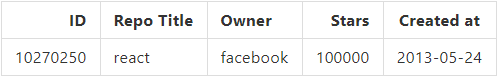

## INFO
It's an application for searching github repositories. The project has been made only for the purpose of learning react.

# LIVE
https://fjollsfinn.github.io/repo_searcher/  
`You can also run it in development mode. Info at the and of this page.`

## task assumptions:
Develop an application displaying dynamic tabular data using React and fetching data using Github public api.

Your app should render an input that is used to search Github repositories.
Consider:

- Make an API request to the Github API on input change, and get the result data
- Do not make an API request if the results are already stored
- Do not fire requests as long as the user is typing. Typically you should throttle requests so that when the user types quickly, we fire one request with the latest input value instead of many
The table should be of the following structure:

 The table should show maximum 5 rows at once.
 Apart from that, please implement the following (locally, not using API queries):
 - Pagination
 - Ability to control number of rows per page (5/10/15)
 - Sorting (asc/desc) by every column
 - A persistence mechanism (e.g. using localStorage) - so it remembers last search and settings after page refresh
Feel free to use your favorite UI components library if you like.

`Extra assumption from me:`
- You can click on header to navigate to main github page
- You can click on any rows to open a popup with clicked item title, a description and button which navigates to github repozitory

`specification`: https://hackmd.io/s/r1lLqA8S4

## Running in development mode mode
This project was bootstrapped with [Create React App](https://github.com/facebook/create-react-app).

In the project directory, you can run:

### `npm start`

Runs the app in the development mode. 
Open [http://localhost:3000](http://localhost:3000) to view it in the browser.

The page will reload if you make edits. 